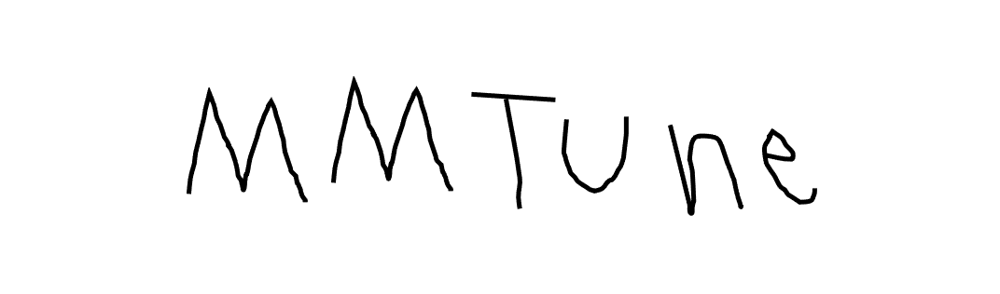

  

## Introduction
MMTune is an open-source deep learning model hyperparameter tuning toolbox especially for OpenMMLab's model frameworks such as [mmdetection](https://github.com/open-mmlab/mmdetection) and [mmsegmentation](https://github.com/open-mmlab/mmsegmentation). In order to support job scheduling and resource management, MMTune adopts [Ray](https://github.com/ray-project/ray) and [Ray.tune](https://docs.ray.io/en/latest/tune/index.html).

Currently, MMTune is maintained by SI-Analytics.

### Major features

- **Fully support OpenMMLab models**

  We provide a unified model hyperparameter tuning toolbox for the codebases in OpenMMLab. The supported codebases are listed as below, and more will be added in the future
  - [ ] [MMClassification](https://github.com/open-mmlab/mmclassification)
  - [x] [MMDetection](https://github.com/open-mmlab/mmdetection)
  - [x] [MMSegmentation](https://github.com/open-mmlab/mmsegmentation)
  - [ ] [MMEditing](https://github.com/open-mmlab/mmediting)

- **Support state-of-the-art hyperparameter tuning algorithms**

    We provide state-of-the-art hyperparameter tuning algorithms such as below;
  - [x] [Nevergrad](https://github.com/facebookresearch/nevergrad)
  - [x] [Adaptive Experimentation (AX)](https://ax.dev/)
  - [x] [HyperOpt](https://github.com/hyperopt/hyperopt)
  - [x] [FLAML](https://github.com/microsoft/FLAML)
  - [x] [Scikit-optimize](https://github.com/scikit-optimize/scikit-optimize)

- **Distributed tuning system based on Ray**

    Hyperparameter tuning with multi-GPU training or large-scale job scheduling are managed by Ray's distributed compute framework.

## License

This project is released under the [Apache 2.0 license](LICENSE).

## Installation and Getting Started

Please refer to [get_started.md](docs/get_started.md) for installation and getting started.
